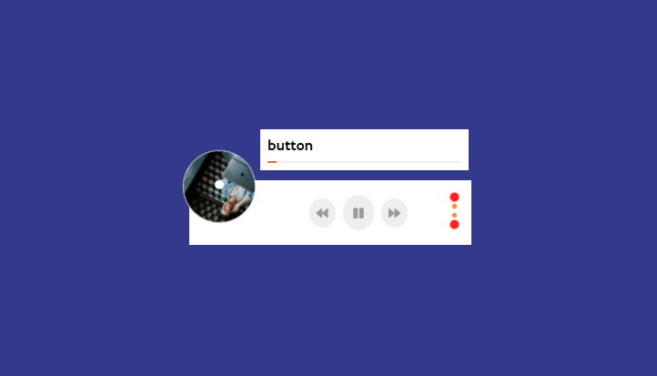

# Music Player Using Vanilla JavaScript.

Hey Guys! This project is very simple music player and it's working perfectly. I know it's not better and full package for music player. Though If has any people to made it much better than it Please feel free to contribute it and made if very impressive as like you want. And Also you want this kind a project in futer please follow me and check this out my other project. Thanks

## Using Technology
- Vanilla JavaScript
- HTML5/HTML
- CSS3/CSS
- Git bash/ Github
- VS Code Editor
- Font Awesome 
- Google Fonts (Optional)
- Some Media Audio Songs From Internet with Image
- Icon8 for favicon

### If you want to see live link please [Click Here to go](https://ashik-mahmud.github.io/music-player/)

### Its demo screenshot about in my project

> Thanks for reachout in github account Please Follow or Star this project
